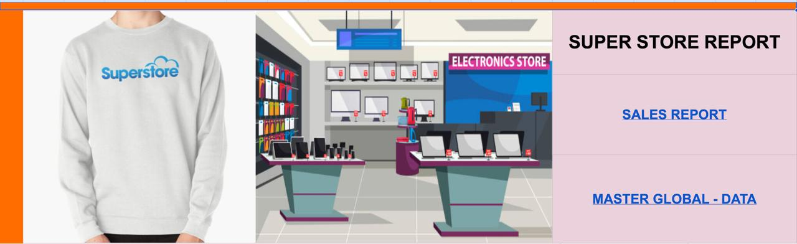
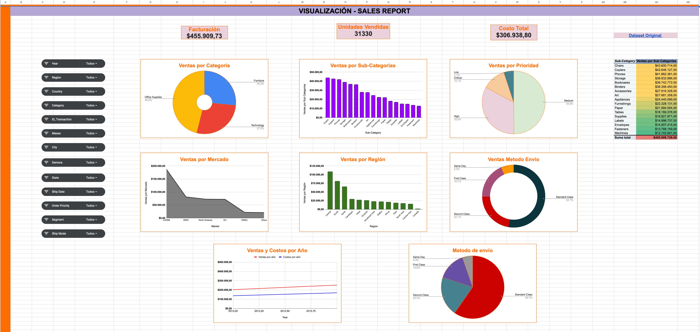

# Dashboard operativo – Google Sheets

**Stack:** Google Sheets (ETL ligera + tablas dinámicas + charts) · Excel (fuente)  
**Dataset:** Master Global Super Store (2013–2014)

## 🎯 Objetivo
Construir un **dashboard operativo** que permita entender ventas, costos y rentabilidad por **categoría**, **subcategoría**, **mercado** y **región**, además de **métodos de envío** y **prioridad de pedido**.

## 📦 Fuente de datos
- Dataset (original): [`data/raw/MasterGlobalSuperStore.xlsx`](data/raw/MasterGlobalSuperStore.xlsx)  
- Presentación ejecutiva: [`docs/presentacion/masterglobalsuperstore.pdf`](docs/presentacion/masterglobalsuperstore.pdf)

## 🛠️ Proceso (ETL liviana en Sheets)
1. Importar el Excel a Google Sheets.  
2. **Limpieza y normalización:** quitar filas/columnas irrelevantes; acotar periodo 2013–2014.  
3. **Clave primaria:** combinar `Order_ID` + `Product_ID`.  
4. **Lead time de entrega:** `Ship_Date - Order_Date` + variables auxiliares.  
5. Tablas dinámicas y gráficos para KPIs de negocio.

## 📊 Hallazgos clave
- **Ventas por categoría:** *Office Supplies* concentra ~46 % del total.  
- **Subcategorías top-3:** Chairs, Bookcases, Binders & Storage (> $35M cada una).  
- **Mercados:** *LATAM* lidera (~$187M), seguido de *APAC* y *North America*.  
- **Regiones:** destacan *Central* y *North*; *Canada* es la menor.  
- **Ventas y costos por año:** ventas crecen ~24 % (2013→2014) y suben costos; 2014 es el año más rentable.  
- **Envíos:** *Standard Class* concentra ~60 % de envíos y también la mayor cifra de ventas (~$240M).  
- **Prioridad de pedido:** predominan *Medium* (~50 %) y *High* (~33 %).

> Estos puntos provienen del análisis del dataset y la presentación adjunta.

## 🖥️ Dashboard (capturas)

## 🗂️ Estructura del repo

├─ README.md
├─ data
│  └─ raw
│     └─ MasterGlobalSuperStore.xlsx
├─ docs
│  └─ presentacion
│     └─ masterglobalsuperstore.pdf
└─ img
├─ kpis.png
├─ categorias.png
├─ masterglobalsuperstore1.jpeg
└─ masterglobalsuperstore2.jpeg

---

**Autor:** Eric Sanchez — Data Analyst (Admin & Finance)  
**Créditos de datos:** Global Superstore / Sample Superstore (educativo).
